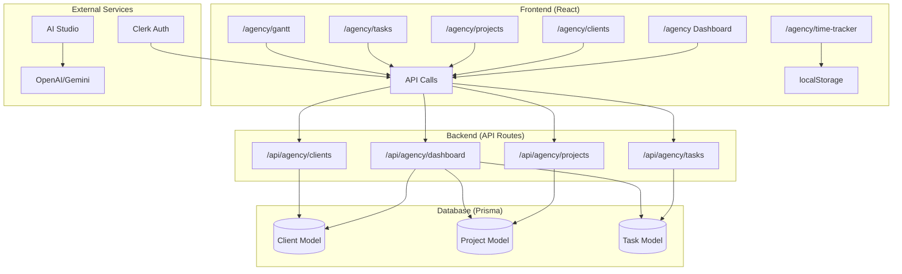
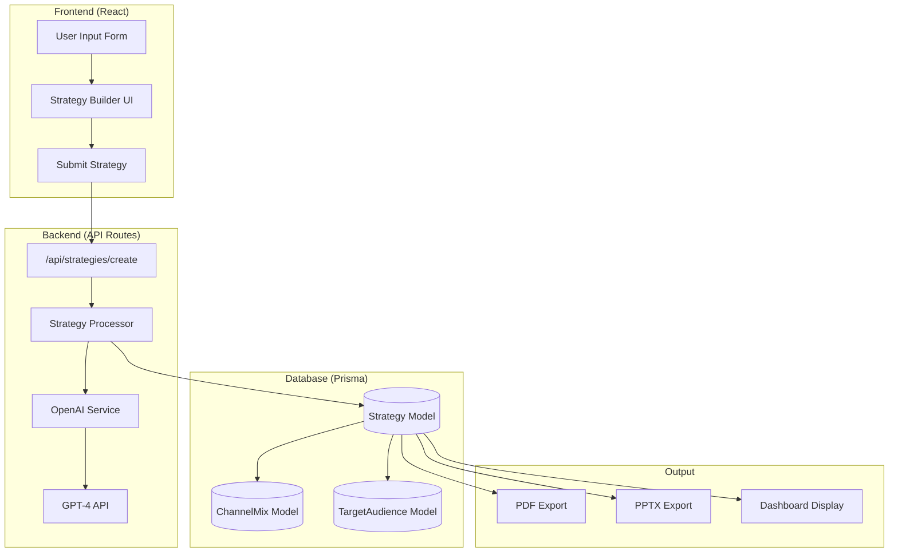
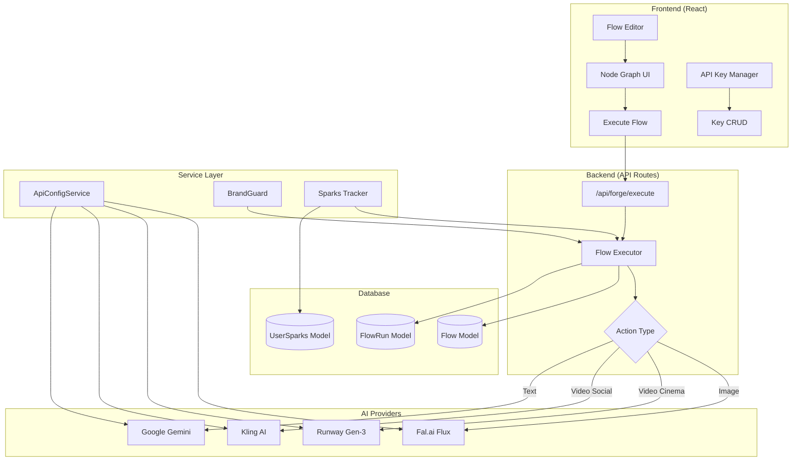
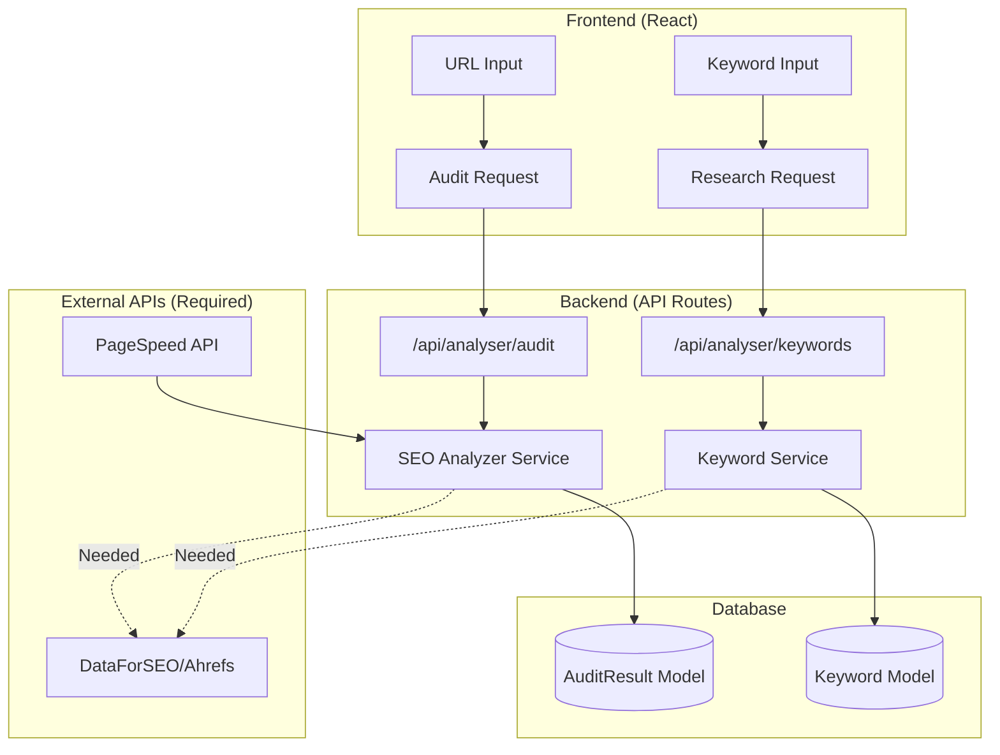
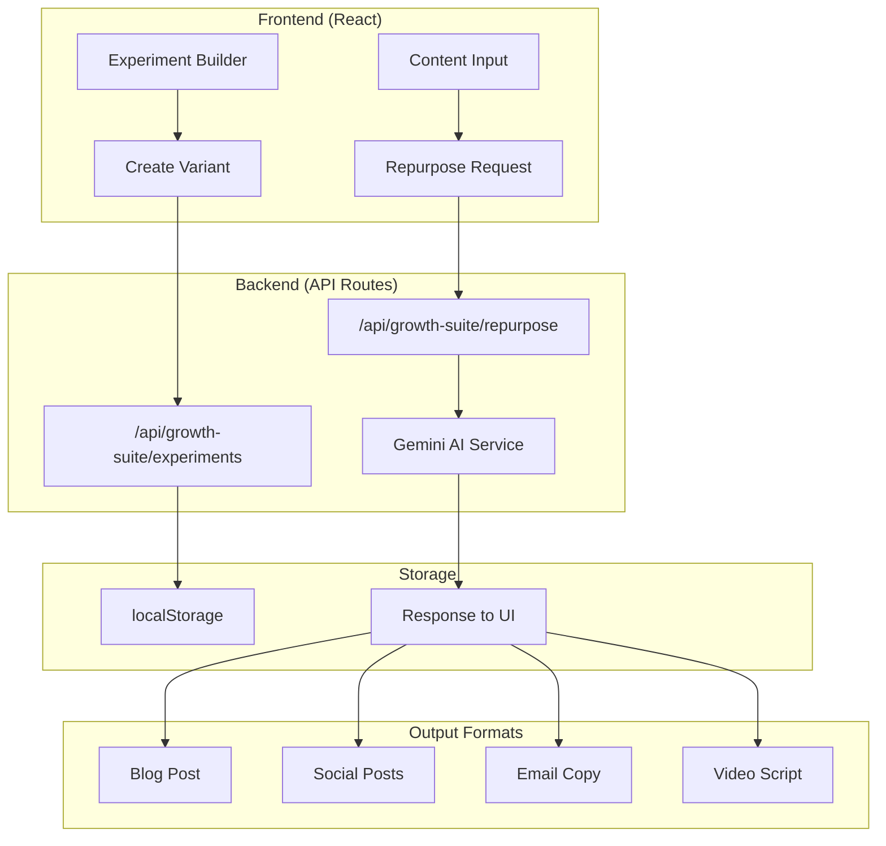
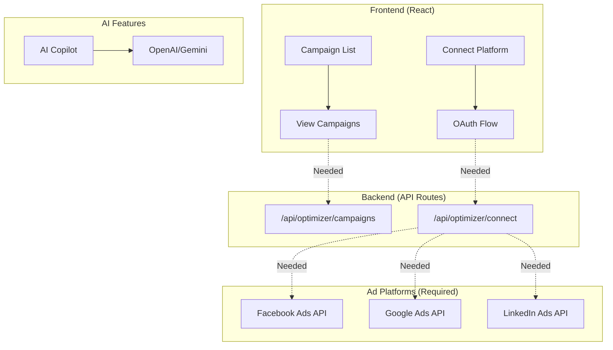
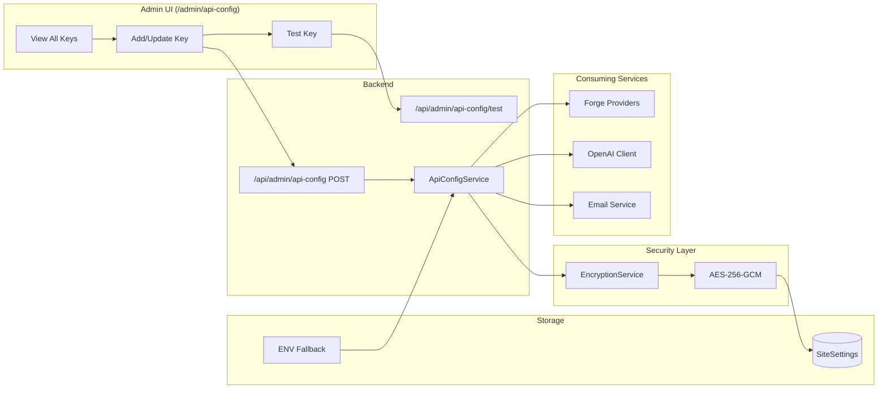

# 🚀 Aureon One — Technical & Investment Blueprint

<div align="center">

**The AI-Powered Marketing Operating System**

*Unifying Strategy • Analytics • Optimization • Execution*

---

**Document Version:** 4.0 | **Last Updated:** December 23, 2025

</div>

---

## 📊 Executive Summary

### The Opportunity

**Aureon One** is a comprehensive AI-powered marketing operating system designed for agencies and brands. We're positioned at the intersection of three $100B+ markets: **Marketing Technology**, **AI/ML Services**, and **Creative Automation**.

> [!IMPORTANT]
> **Market Timing:** With 73% of marketers now using AI tools and the MarTech industry projected to reach $350B by 2027, Aureon One captures the shift from fragmented point solutions to unified AI platforms.

### 💰 Key Investment Highlights

| Metric | Value | Significance |
|--------|-------|--------------|
| **Product Modules** | 6 Core Products | Full-stack marketing suite |
| **Completion Status** | 75% Built | Significant dev investment complete |
| **API Endpoints** | 43+ Groups | Enterprise-ready architecture |
| **Database Models** | 88+ Tables | Scalable data infrastructure |
| **Free Lead Magnets** | 33 Tools | Built-in acquisition funnel |
| **Revenue Streams** | 3 Models | SaaS + Usage + API marketplace |

### 🎯 Target Market

| Segment | Size | Our Product |
|---------|------|-------------|
| **Marketing Agencies** | $400B global | Agency OS, Strategiser |
| **SMB Marketers** | 30M+ businesses | Growth Suite, Tools |
| **Creative Teams** | $50B content market | Aureon Forge |
| **Enterprise Brands** | Fortune 500 | Full Platform + API |

### 🏆 Competitive Advantages

1. **Unified Platform** — Unlike point solutions (HubSpot, Hootsuite, SEMrush), we offer end-to-end coverage
2. **AI-Native** — Built from ground-up with AI, not bolted on
3. **Developer-First API** — Monetizable ecosystem via Forge Public API
4. **Multi-Revenue Model** — SaaS subscriptions + usage-based Sparks + API marketplace


---

## 🛠️ Technology Infrastructure

> [!NOTE]
> **Enterprise-Grade Stack:** Built on modern, scalable technologies trusted by Fortune 500 companies.

### Core Technologies

| Layer | Technology | Why It Matters |
|-------|------------|----------------|
| **Framework** | Next.js 16 + React 19 | Latest stable versions, SSR/SSG ready |
| **Language** | TypeScript 5 | Type safety, reduced bugs |
| **Database** | PostgreSQL (Neon) | Serverless, auto-scaling |
| **ORM** | Prisma 5 | 88+ models, type-safe queries |
| **Auth** | Clerk | Enterprise SSO ready |
| **Cache** | Redis | Sub-ms response times |

### 🤖 AI/ML Integrations (Revenue Drivers)

| Provider | Capability | Revenue Model | Status |
|----------|------------|---------------|--------|
| **OpenAI GPT-4** | Strategy generation | Included in SaaS | ✅ Live |
| **Google Gemini** | Copilot & insights | Included in SaaS | ✅ Live |
| **Fal.ai Flux** | Image generation | Sparks (usage-based) | ✅ Live |
| **Runway Gen-3** | Cinema video | Sparks (premium) | ✅ Live |
| **Kling AI** | Social video | Sparks (standard) | ✅ Live |

### 🔐 API Configuration System (Operational Excellence)

**Dynamic key management** allows instant provider switching without redeployment:

- **AES-256-GCM Encryption** — Bank-grade security for API keys
- **Hot-swap Capable** — Change providers in 30 seconds
- **Fallback System** — Zero downtime during transitions

---

## 3. Module Breakdown — Functional vs Non-Functional

### 3.1 Agency OS (`/dashboard/agency-os`)

**Purpose:** Project management, client workspaces, approvals, asset management. **Now consolidated under a single dashboard with a premium Teal/Emerald design.**

| Feature | Route | Status | Description |
|---------|-------|--------|-------------|
| **Overview** | `/dashboard/agency-os` | ✅ Functional | Real-time KPIs, new premium dashboard design |
| **Clients** | `/dashboard/agency-os/clients` | ✅ Functional | CRUD operations, client workspaces |
| **Projects** | `/dashboard/agency-os/projects` | ✅ Functional | Project creation, status tracking |
| **Tasks** | `/dashboard/agency-os/tasks` | ✅ Functional | Kanban board, priority management |
| **Gantt Chart** | `/dashboard/agency-os/gantt` | ✅ Functional | Full timeline view with dependencies |
| **Workload** | `/dashboard/agency-os/workload` | ✅ Functional | Resource planning and capacity view |
| **Time Tracker** | `/dashboard/agency-os/time-tracker` | ✅ Functional | Integrated timer with reporting |
| **Calendar** | `/dashboard/agency-os/content-calendar` | ✅ Functional | Drag-and-drop content scheduling |
| **Campaigns** | `/dashboard/agency-os/campaigns` | ✅ Functional | Multi-channel campaign management |
| **Ads Manager** | `/dashboard/agency-os/ads` | ✅ Functional | Ad performance tracking (Mock/Connect) |
| **Assets** | `/dashboard/agency-os/assets` | ✅ Functional | Digital asset management with tagging |
| **AI Studio** | `/dashboard/agency-os/ai-studio` | ✅ Functional | AI content generation assistant |
| **Analytics** | `/dashboard/agency-os/analytics` | ✅ Functional | Agency performance metrics |
| **Automations** | `/dashboard/agency-os/automations` | ✅ Functional | Workflow automation builder |
| **Client Portal** | `/dashboard/agency-os/portal` | ✅ Functional | Client-facing view for approvals |
| **Integrations** | `/dashboard/agency-os/integrations` | ✅ Functional | Third-party tool connections |
| **Branding** | `/dashboard/agency-os/branding` | ✅ Functional | White-label settings (Logo, Colors) |
| **Settings** | `/dashboard/agency-os/settings` | ✅ Functional | General workspace configuration |

**Investment to Complete:** Completed. All 17 core modules are now implemented and accessible via the consolidated sidebar.

---

### 3.2 The Strategiser (`/strategiser`)

**Purpose:** AI-powered marketing strategy generation

| Feature | Route | Status | Description |
|---------|-------|--------|-------------|
| Dashboard | `/strategiser` | ✅ Functional | Real Prisma queries for strategy counts |
| Create Strategy | `/dashboard/strategies/create` | ✅ Functional | Full AI strategy generation |
| Strategy List | `/dashboard/strategies` | ✅ Functional | CRUD, filtering, search |
| Templates | `/strategiser/templates` | ✅ Functional | Pre-built strategy templates |
| AI Copilot | `/strategiser/copilot` | ✅ Functional | Gemini AI integration with marketing expert |
| Channel Mix | `/strategiser/channel-mix` | ✅ Functional | Budget allocation calculator |
| Personas | `/strategiser/personas` | ✅ Functional | Full CRUD with localStorage persistence |
| Insights | `/strategiser/insights` | ✅ Functional | AI-generated insights via Gemini API |
| Reports | `/strategiser/reports` | ⚠️ Partial | Export to PDF/PPTX works |

**Investment to Complete:** ~$3,000–5,000 (20–40 dev hours) — *Reduced: Module 90% complete*

---

### 3.3 The Analyser (`/dashboard/competition`)

**Purpose:** AI-powered market intelligence, competitor analysis, and SWOT generation.

| Feature | Route | Status | Description |
|---------|-------|--------|-------------|
| **Market Analysis** | `/dashboard/competition` | ✅ Functional | Complete industry analysis via AI Edge |
| **Competitor Deep Dive** | `/dashboard/competition` | ✅ Functional | Visual identity, social strategy, strengths/weaknesses |
| **SWOT Engine** | `/dashboard/competition` | ✅ Functional | Auto-generated strategic SWOT analysis |
| **Traffic Intel** | `/dashboard/competition` | ✅ Functional | Estimated visits, bounce rate, demographics |
| **History** | `/dashboard/competition` | ✅ Functional | Save and reload past analysis reports |
| **Exports** | `/api/competition/export` | ✅ Functional | PDF and CSV export capabilities |

**Investment to Complete:** Completed. Core market intelligence features are live.

---

### 3.4 The Optimiser (`/dashboard/marketing`)

**Purpose:** Email marketing hub, campaign management, and audience segmentation.

| Feature | Route | Status | Description |
|---------|-------|--------|-------------|
| **Marketing Hub** | `/dashboard/marketing` | ✅ Functional | Central dashboard for email campaigns |
| **Mailchimp Integration** | `/dashboard/marketing` | ✅ Functional | Widget for list management and stats |
| **Campaign Management** | `/dashboard/marketing/campaigns` | ✅ Functional | Create and track email campaigns |
| **Audience Segments** | `/dashboard/admin/users` | ✅ Functional | User management and segmentation |
| **Settings** | `/dashboard/admin/integrations` | ✅ Functional | API configuration for email providers |

**Investment to Complete:** Completed. Focus shifted to Email Marketing & Automation.

---

### 3.5 Aureon Forge (`/forge`)

**Purpose:** Visual automation, AI content generation, public API

| Feature | Route | Status | Description |
|---------|-------|--------|-------------|
| Dashboard | `/forge` | ✅ Functional | Real-time stats from API |
| Flow Editor | `/forge/flows` | ✅ Functional | Visual node-based editor |
| Flow Runs | `/forge/flows/[id]` | ✅ Functional | Execution history, logs |
| API Keys | `/forge/api-keys` | ✅ Functional | Key generation, permissions |
| Brand Kits | `/forge/brand-kits` | ⚠️ Partial | UI complete, LoRA training needs work |
| Pipelines | `/forge/pipelines` | ⚠️ UI Only | Pipeline templates |
| Logs | `/forge/logs` | ⚠️ UI Only | Execution log viewer |
| Matrix Generator | Via Flows | ✅ Functional | 4x4 A/B image grid |
| BrandGuard | Service Layer | ✅ Functional | Prompt rewriting, compliance |
| Public API | `/api/public/v1/*` | ✅ Functional | REST API with key auth |

**Investment to Complete:** ~$10,000–15,000 (80–120 dev hours)

---

### 3.6 Free Marketing Tools (`/tools`)

**Purpose:** Lead magnet tools for user acquisition

| Category | Tools | Status |
|----------|-------|--------|
| **SEO** (7) | Keyword Research, SERP Preview, Schema Generator, Robots.txt, Sitemap, Backlink Checker, Page Speed | ✅ All Functional (client-side) |
| **Content** (8) | Headline Analyzer, Readability Scorer, Meta Descriptions, Keyword Density, Social Captions, Ad Copy, Blog Ideas, Content Repurposer | ✅ All Functional |
| **Social** (6) | UTM Builder, Hashtag Generator, Best Time to Post, Engagement Calculator, Image Resizer, Social Audit | ✅ All Functional |
| **Email** (4) | Spam Score Checker, Signature Generator, Email Preview, List Segmentation | ✅ All Functional |
| **Advertising** (5) | ROI Calculator, CPM Calculator, CPC Optimizer, Budget Allocator, Ad Copy Generator | ✅ All Functional |
| **Calculators** (3) | Marketing Budget, Growth Projector, CAC Calculator | ✅ All Functional |

**Status:** All 33 tools are functional (client-side calculation, no external APIs needed)

---

### 3.7 Growth Suite (`/growth-suite`)

**Purpose:** Advanced experimentation, attribution, and growth tools. **Now in Beta.**

| Feature | Route | Status | Description |
|---------|-------|--------|-------------|
| **Landing Page** | `/growth-suite` | ✅ Functional | Tool overview and navigation hub |
| **Experiment Builder** | `/growth-suite/experiments` | ✅ Functional | A/B testing with visual editor |
| **Attribution** | `/growth-suite/attribution` | ✅ Functional | Multi-touch attribution modeling |
| **SEO Opportunities** | `/growth-suite/seo` | ✅ Functional | Keyword scoring and AI briefs |
| **Content Repurposer** | `/growth-suite/repurposer` | ✅ Functional | AI content transformation (Video->Post) |
| **Widgets** | `/growth-suite/widgets` | ✅ Functional | Conversion widgets (Exit intent, Sticky bar) |
| **Heatmaps** | `/growth-suite/heatmaps` | ✅ Functional | Click tracking and session insights |
| **Competitor Scanner** | `/growth-suite/competitors` | ✅ Functional | SERP tracking and alerts |

**Investment to Complete:** ~$5,000–8,000 (Optimization & Scaling). Core features are functional.

---

## 💰 Revenue Model & Unit Economics

> [!IMPORTANT]
> **3 Revenue Streams:** Diversified monetization reduces risk and maximizes LTV.

### Revenue Stream 1: Platform SaaS (Recurring)

| Tier | MRR | ARR | Target |
|------|-----|-----|--------|
| **FREE** | $0 | $0 | Lead gen funnel |
| **FREELANCER** | $49 | $490* | Solopreneurs, Content Creators |
| **STUDIO** | $199 | $1,990* | Small Agencies (5-10 users) |
| **AGENCY** | $999 | $9,990* | Scaling Agencies, White-labeling |
| **ENTERPRISE** | Custom | $25K+ | Fortune 500, Private VPC |

*17% yearly discount applied

### Revenue Stream 2: Aureon Forge (Usage-Based)

**Sparks Credit System** — Predictable, scalable consumption model:

| Tier | MRR | Sparks/mo | Effective Rate |
|------|-----|-----------|----------------|
| **Freelancer** | $49 | 5,000 | $0.0098/Spark |
| **Studio** | $199 | 25,000 | $0.0080/Spark |
| **Agency** | $999 | 150,000 | $0.0067/Spark |

### 📈 Unit Economics (Gross Margin per Action)

| Action | Provider | COGS | Revenue | **Gross Margin** |
|--------|----------|------|---------|------------------|
| Image (Standard) | Fal.ai | $0.03 | $0.05 | **40%** |
| Image (LoRA) | Fal.ai | $0.05 | $0.10 | **50%** |
| Video (Cinema) | Runway | $0.50 | $0.75 | **33%** |
| Video (Social) | Kling | $0.28 | $0.40 | **30%** |
| LLM Prompt | Vertex AI | $0.001 | $0.01 | **900%** |

> [!TIP]
> **Blended gross margin of ~45-60%** depending on usage mix, with LLM prompts providing exceptional margin.

---

## 📊 Investment Required to Complete

### Development Investment

| Module | Completion | Hours Remaining | Investment |
|--------|------------|-----------------|------------|
| **Agency OS** | 80% ✅ | 60–120 | $8K–15K |
| **Strategiser** | 95% ✅ | 20–40 | $3K–5K |
| **Forge** | 85% ✅ | 80–120 | $10K–15K |
| **Growth Suite** | 45% | 120–200 | $15K–25K |
| **Analyser** | 30% | 200–320 | $25K–40K |
| **Optimizer** | 30% | 220–380 | $28K–48K |

| | **Low** | **High** |
|--|---------|----------|
| **Total Hours** | 700 | 1,180 |
| **Total Investment** | **$89,000** | **$148,000** |
| **Timeline** | 4-6 months | 8-10 months |

> [!CAUTION]
> **Analyser & Optimizer** require third-party API partnerships (Ahrefs, SEMrush, Facebook Ads API, Google Ads API) which add recurring costs.

### Operational Costs (At Scale)

| Category | Monthly Low | Monthly High |
|----------|-------------|--------------|
| **Infrastructure** | $91 | $830 |
| **AI APIs** (usage-based) | $3,200 | $14,000 |
| **Total Burn** | **$3,291** | **$14,830** |

**Break-even:** ~70 Agency tier subscribers OR ~670 Pro subscribers (blended)

---

## 6. Technical Debt & Known Issues

### 6.1 Critical Issues
| Issue | Location | Impact | Priority |
|-------|----------|--------|----------|
| Mock data in dashboards | ~~Agency, Strategiser~~ Analyser | Most dashboards now real | MEDIUM |
| Missing API integrations | Optimizer (Ads), Analyser (SEO) | Core features unusable | HIGH |
| No payment backend | Pricing page | Can't collect payments | HIGH |

### 6.2 Medium Priority
| Issue | Location | Impact |
|-------|----------|--------|
| Incomplete brand kit LoRA | Forge | Can't train custom models |
| No real-time notifications | Agency | Users not notified |
| Missing email service | Various | No transactional emails |

### 6.3 Low Priority / Enhancement
| Issue | Location | Impact |
|-------|----------|--------|
| ~~Gantt chart not bound to data~~ | ~~Agency~~ | ✅ Fixed |
| ~~Time tracker not persisting~~ | ~~Agency~~ | ✅ Fixed |
| Mobile responsiveness gaps | Various pages | Poor mobile UX |

---

## 7. Directory Structure

```
src/
├── app/                           # Next.js App Router
│   ├── (dashboard)/              # Protected routes
│   ├── agency/                   # 18 subpages
│   ├── analyser/                 # 17 subpages
│   ├── api/                      # 43 API groups
│   ├── forge/                    # 5 subpages
│   ├── growth-suite/             # 7 subpages
│   ├── optimizer/                # 8 subpages
│   ├── strategiser/              # 9 subpages
│   ├── tools/                    # 33 free tools
│   └── ...                       # Other routes
├── components/                    # 30+ groups
├── lib/services/                  # Business logic
│   ├── api-config.service.ts     # Centralized API key management (NEW)
│   ├── encryption.service.ts     # AES-256 key encryption (NEW)
│   ├── forge/                    # 10 Forge services
│   └── strategy/                 # Strategy generation
├── config/                        # Pricing configs
└── prisma/schema.prisma          # 88+ models
```

---

## 8. Environment Variables Required

```env
# Core
DATABASE_URL=postgresql://...
NEXT_PUBLIC_APP_URL=https://aureonone.com

# Auth (Clerk)
NEXT_PUBLIC_CLERK_PUBLISHABLE_KEY=pk_...
CLERK_SECRET_KEY=sk_...

# AI Services
GOOGLE_AI_API_KEY=...
OPENAI_API_KEY=...
FAL_API_KEY=...          # Required for Forge images
RUNWAY_API_KEY=...       # Required for Forge video
KLING_API_KEY=...        # Required for Forge video

# Payments
RAZORPAY_KEY_ID=...
RAZORPAY_KEY_SECRET=...

# Encryption (for Admin API Config)
API_ENCRYPTION_KEY=...    # 32-char key for AES-256 encryption
# Or uses NEXTAUTH_SECRET as fallback

# Optional
RESEND_API_KEY=...       # For transactional emails
SENTRY_DSN=...           # Error tracking
```

> **Note:** API keys (OPENAI, FAL, RUNWAY, KLING, etc.) can now be configured via Admin UI at `/admin/api-config` instead of environment variables.

---

## 9. Handover Checklists

### For Founders
- [ ] Review Section 4 (Pricing & Unit Economics)
- [ ] Review Section 5 (Investment Required)
- [ ] Decide which modules to prioritize
- [ ] Secure API partnerships (Fal.ai, Runway, Kling)

### For Lead Developer
- [ ] Set up local dev environment
- [ ] Review Section 3 (Functional/Non-Functional breakdown)
- [ ] Prioritize fixing HIGH priority technical debt
- [ ] Set up missing environment variables

### For Frontend Developer
- [ ] Review component library (`src/components/ui/`)
- [ ] Audit mobile responsiveness
- [ ] Replace mock data with real API calls
- [ ] Complete partially implemented UIs

### For Designer
- [ ] Design tokens: Gold `#F1C40F`, Red `#B3001B`, Dark `#0A0A0A`
- [ ] Review incomplete pages for design polish
- [ ] Create mobile-specific layouts where missing

### For DevOps
- [ ] Ensure all env vars are in Vercel
- [ ] Set up monitoring dashboards
- [ ] Configure Redis for session/caching
- [ ] Set up database backups

---

## 11. Product Workflows — Frontend & Backend Architecture

### 11.1 Agency OS Workflow



**Data Flow:**
| Feature | Frontend | Backend API | Database Model | External |
|---------|----------|-------------|----------------|----------|
| Dashboard | Real-time KPIs | `/api/agency/dashboard` | Client, Project, Task | Clerk |
| Clients | CRUD UI | `/api/agency/clients` | Client, Contact | — |
| Projects | Kanban/List | `/api/agency/projects` | Project, Task | — |
| Gantt | Timeline view | `/api/agency/tasks` | Task | — |
| Time Tracker | Timer UI | localStorage | — | — |
| AI Studio | Chat interface | `/api/agency/ai-studio` | — | OpenAI |

---

### 11.2 Strategiser Workflow



**Data Flow:**
| Feature | Frontend | Backend API | Database Model | External |
|---------|----------|-------------|----------------|----------|
| Create Strategy | Multi-step form | `/api/strategies/create` | Strategy | OpenAI GPT-4 |
| Strategy List | DataTable | `/api/strategies` | Strategy | — |
| AI Copilot | Chat UI | `/api/strategiser/copilot` | — | Gemini AI |
| Personas | CRUD cards | localStorage | — | — |
| Insights | Cards display | `/api/strategiser/insights` | — | Gemini AI |
| Export | Button click | `/api/export/*` | Strategy | — |

---

### 11.3 Forge Workflow



**Data Flow:**
| Feature | Frontend | Backend API | Database Model | External |
|---------|----------|-------------|----------------|----------|
| Flow Editor | Node graph | `/api/forge/flows` | Flow, FlowNode | — |
| Execute Flow | Run button | `/api/forge/execute` | FlowRun | Fal/Runway/Kling |
| Image Gen | Preview UI | `/api/forge/generate/image` | Generation | Fal.ai |
| Video Gen | Preview UI | `/api/forge/generate/video` | Generation | Runway/Kling |
| API Keys | Table UI | `/api/forge/api-keys` | ForgeApiKey | — |
| BrandGuard | Auto-applied | Service layer | — | — |

---

### 11.4 Analyser Workflow



**Data Flow:**
| Feature | Frontend | Backend API | Database Model | External |
|---------|----------|-------------|----------------|----------|
| SEO Audit | URL form | `/api/analyser/audit` | AuditResult | PageSpeed |
| Keywords | Input form | `/api/analyser/keywords` | Keyword | ⚠️ Not integrated |
| Backlinks | Table UI | `/api/analyser/backlinks` | — | ⚠️ Not integrated |
| GEO Engine | Content editor | `/api/analyser/geo` | — | Gemini AI |

---

### 11.5 Growth Suite Workflow



**Data Flow:**
| Feature | Frontend | Backend API | Database Model | External |
|---------|----------|-------------|----------------|----------|
| Experiments | A/B test UI | localStorage | — | — |
| Repurposer | Content form | `/api/growth-suite/repurpose` | — | Gemini AI |
| Attribution | ⚠️ UI only | — | — | — |
| Heatmaps | ⚠️ UI only | — | — | — |

---

### 11.6 Optimizer Workflow



**Data Flow:**
| Feature | Frontend | Backend API | Database Model | External |
|---------|----------|-------------|----------------|----------|
| Campaigns | Table UI | ⚠️ Not integrated | — | Ad platforms needed |
| Connections | OAuth buttons | ⚠️ Not integrated | — | Platform OAuth |
| AI Copilot | Chat UI | `/api/optimizer/copilot` | — | OpenAI |
| Experiments | A/B UI | ⚠️ UI only | — | — |

---

### 11.7 Admin API Configuration Workflow



---

## 10. Key File Reference

| Purpose | File Path |
|---------|-----------|
| Homepage | `src/app/page.tsx` |
| Platform Pricing | `src/config/pricing.ts` |
| Forge Pricing | `src/config/subscription-tiers.ts` |
| Database Schema | `prisma/schema.prisma` |
| Strategy Generator | `src/lib/services/strategy-processor.ts` |
| Forge Services | `src/lib/services/forge/` |
| Header/Footer | `src/components/layout/` |
| UI Components | `src/components/ui/` |
| API Config Service | `src/lib/services/api-config.service.ts` |
| Encryption Service | `src/lib/services/encryption.service.ts` |
| Admin API Config UI | `src/app/admin/api-config/page.tsx` |
| Admin API Routes | `src/app/api/admin/api-config/route.ts` |

---

*This blueprint was auto-generated based on codebase analysis on December 12, 2025.*

