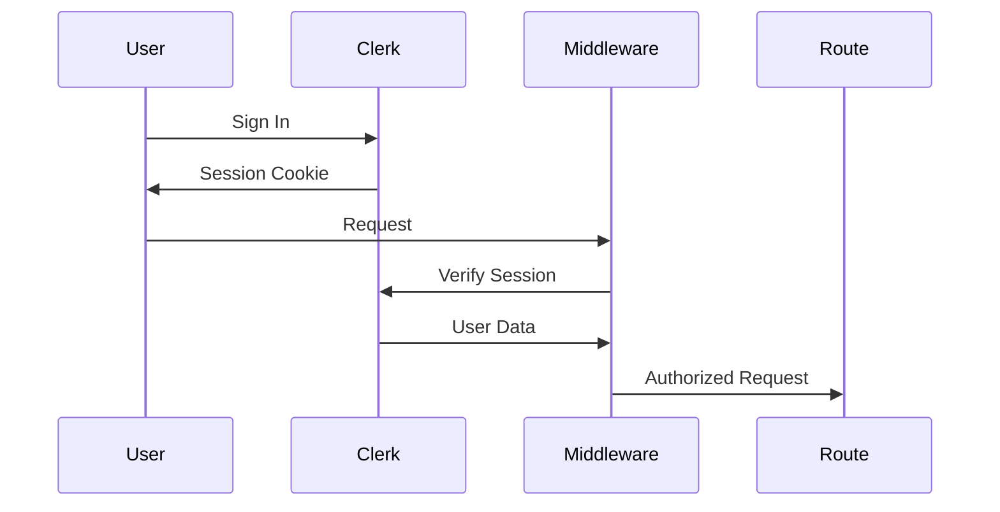

# MediaPlanPro - Master Developer Documentation
## Comprehensive Platform Reference Guide

**Version:** 2.0  
**Last Updated:** December 8, 2025

---

## Table of Contents

1. [Platform Overview](#platform-overview)
2. [Architecture](#architecture)
3. [Feature Modules](#feature-modules)
4. [Tools Reference](#tools-reference)
5. [Agency OS](#agency-os)
6. [Pricing Plans](#pricing-plans)
7. [API Reference](#api-reference)
8. [Configuration](#configuration)
9. [Deployment](#deployment)

---

## 1. Platform Overview

### What is MediaPlanPro?

MediaPlanPro is an **AI-driven marketing plan builder** that helps marketers create data-driven marketing strategies. The platform includes:

- **Strategy Generator**: AI-powered marketing strategy creation
- **Free Marketing Tools**: 25+ free tools for SEO, social, content, advertising
- **Agency OS**: Complete project management for marketing agencies
- **Blog**: Auto-generated marketing insights content

### Technology Stack

| Layer | Technology |
|-------|------------|
| Frontend | Next.js 14 (App Router), React 18, TypeScript |
| Styling | Tailwind CSS, shadcn/ui components |
| Database | PostgreSQL (Supabase), Prisma ORM |
| Authentication | Clerk (SSO, MFA, custom domains) |
| File Storage | Cloudflare R2 / Supabase Storage |
| Hosting | Vercel (Edge Runtime) |
| Real-time | Pusher (WebSocket) |
| AI | OpenAI GPT-4, Google Gemini |

### Directory Structure

```
src/
├── app/                    # Next.js 14 App Router
│   ├── (auth)/             # Auth routes (sign-in, sign-up)
│   ├── (marketing)/        # Public marketing pages
│   ├── agency/             # Agency OS module
│   ├── api/                # API routes
│   ├── blog/               # Blog module
│   ├── dashboard/          # User dashboard
│   └── tools/              # Free marketing tools
├── components/             # React components
│   ├── agency/             # Agency OS components
│   ├── blog/               # Blog components
│   ├── dashboard/          # Dashboard components
│   ├── seo/                # SEO components
│   └── ui/                 # shadcn/ui components
├── lib/                    # Utilities & services
│   ├── agency/             # Agency services
│   ├── exports/            # Document export
│   ├── realtime/           # WebSocket service
│   └── services/           # Core services
└── prisma/                 # Database schema
```

---

## 2. Architecture

### Request Flow

```
User → Clerk Middleware → Next.js App Router → API Route → Service → Prisma → PostgreSQL
                              ↓
                        Server Components
                              ↓
                        Client Components (hydrated)
```

### Key Patterns

1. **Server Components by Default**: All pages are server-rendered
2. **API Routes**: `/api/*` for data mutations
3. **Services Layer**: Business logic in `/lib/services/`
4. **Prisma ORM**: Type-safe database queries
5. **Clerk Auth**: Middleware protects routes

### Authentication Flow



---

## 3. Feature Modules

### 3.1 Strategy Generator

**Location:** `/src/app/dashboard/strategy/`

Creates AI-powered marketing strategies based on business inputs.

#### Input Parameters

| Field | Type | Description |
|-------|------|-------------|
| businessInfo | object | Company name, industry, size, description |
| goals | string[] | Marketing objectives |
| budget | number | Monthly/quarterly budget |
| targetAudience | object | Demographics, interests, behaviors |
| channels | string[] | Preferred marketing channels |

#### Output

- Executive Summary
- Target Audience Personas
- Channel Mix with Budget Allocation
- Content Calendar
- KPIs and Metrics
- ROI Projections

#### Key Files

- `page.tsx` - Main strategy builder UI
- `/lib/services/strategy/` - Strategy generation services
- `/lib/services/strategy/openai-strategy-service.ts` - GPT-4 integration

---

### 3.2 Blog System

**Location:** `/src/app/blog/`

Auto-generated marketing content with SEO optimization.

#### Features

- ISR (Incremental Static Regeneration) with 1-hour revalidation
- Category and tag organization
- Related posts suggestions
- JSON-LD structured data for SEO
- Dark mode support

#### Key Files

- `[slug]/page.tsx` - Individual blog post
- `/lib/blog/` - Blog services
- `/components/blog/` - Blog components

---

### 3.3 Dashboard

**Location:** `/src/app/dashboard/`

User dashboard for strategy management.

#### Features

- Strategy history
- Export to PDF/DOCX/PPTX
- Usage analytics
- Account settings

---

## 4. Tools Reference

### 4.1 SEO Tools

| Tool | Location | Description |
|------|----------|-------------|
| Keyword Research | `/tools/seo/keyword-research-enhanced` | Find relevant keywords |
| Backlink Checker | `/tools/seo/backlink-checker-enhanced` | Analyze backlinks |
| Page Speed Analyzer | `/tools/seo/page-speed-analyzer-enhanced` | Check page performance |
| SERP Preview | `/tools/seo/serp-preview-enhanced` | Preview search results |
| Schema Generator | `/tools/seo/schema-generator-enhanced` | Generate structured data |
| Robots.txt Generator | `/tools/seo/robots-txt-generator-enhanced` | Create robots.txt |
| XML Sitemap Generator | `/tools/seo/xml-sitemap-generator-enhanced` | Generate sitemaps |

### 4.2 Social Media Tools

| Tool | Location | Description |
|------|----------|-------------|
| Hashtag Generator | `/tools/social/hashtag-generator-enhanced` | Generate relevant hashtags |
| Best Time to Post | `/tools/social/best-time-to-post-enhanced` | Optimal posting times |
| Engagement Calculator | `/tools/social/engagement-calculator-enhanced` | Calculate engagement rates |
| UTM Builder | `/tools/social/utm-builder-enhanced` | Create UTM parameters |
| Social Audit Tool | `/tools/social/social-audit-tool-enhanced` | Audit social profiles |
| Image Resizer | `/tools/social/image-resizer-enhanced` | Resize for platforms |

### 4.3 Content Tools

| Tool | Location | Description |
|------|----------|-------------|
| Headline Analyzer | `/tools/content/headline-analyzer-enhanced` | Analyze headlines |
| Readability Scorer | `/tools/content/readability-scorer-enhanced` | Check readability |
| Blog Outline Generator | `/tools/content/blog-outline-generator-enhanced` | Create outlines |
| Meta Description Generator | `/tools/content/meta-description-generator-enhanced` | Generate meta descriptions |
| Content Calendar Generator | `/tools/content/content-calendar-generator-enhanced` | Plan content |
| Social Caption Generator | `/tools/content/social-caption-generator-enhanced` | Write captions |
| Keyword Density Checker | `/tools/content/keyword-density-checker-enhanced` | Analyze keyword usage |
| Email Subject Tester | `/tools/content/email-subject-tester-enhanced` | Test email subjects |

### 4.4 Advertising Tools

| Tool | Location | Description |
|------|----------|-------------|
| Ad Copy Generator | `/tools/advertising/ad-copy-generator-enhanced` | Generate ad copy |
| ROI Calculator | `/tools/advertising/roi-calculator-enhanced` | Calculate ROI |
| Budget Allocator | `/tools/advertising/budget-allocator-enhanced` | Allocate ad budget |
| CPC/CPM Calculator | `/tools/advertising/cpc-cpm-calculator-enhanced` | Calculate costs |
| Landing Page Analyzer | `/tools/advertising/landing-page-analyzer-enhanced` | Analyze landing pages |

### 4.5 Email Tools

| Tool | Location | Description |
|------|----------|-------------|
| Email Preview | `/tools/email/email-preview-enhanced` | Preview emails |
| Signature Generator | `/tools/email/signature-generator-enhanced` | Create signatures |
| Spam Score Checker | `/tools/email/spam-score-checker-enhanced` | Check spam score |
| List Segmentation Calculator | `/tools/email/list-segmentation-calculator-enhanced` | Segment lists |

### Tool Implementation Pattern

Each tool follows this structure:

```typescript
// /src/app/tools/[category]/[tool-name]/page.tsx

export default function ToolPage() {
  const [input, setInput] = useState<InputType>(initialState);
  const [result, setResult] = useState<ResultType | null>(null);
  const [loading, setLoading] = useState(false);

  const handleSubmit = async () => {
    setLoading(true);
    // Process input
    const output = calculateResult(input);
    setResult(output);
    setLoading(false);
  };

  return (
    <ToolLayout>
      <InputSection />
      <ResultSection />
    </ToolLayout>
  );
}
```

---

## 5. Agency OS

**Location:** `/src/app/agency/`

Complete project management system for marketing agencies.

### 5.1 Core Modules

| Module | Page | Description |
|--------|------|-------------|
| Dashboard | `/agency` | Agency overview |
| Clients | `/agency/clients` | Client management |
| Projects | `/agency/projects` | Project tracking |
| Tasks | `/agency/tasks` | Kanban task board |
| Gantt Chart | `/agency/gantt` | Timeline view |
| Workload | `/agency/workload` | Team capacity |
| Time Tracker | `/agency/time-tracker` | Time tracking |
| Campaigns | `/agency/campaigns` | Campaign management |
| Ads Manager | `/agency/ads` | Meta/Google Ads |
| Automations | `/agency/automations` | Workflow automation |
| Content Calendar | `/agency/content-calendar` | Content planning |
| Assets | `/agency/assets` | Digital asset management |
| AI Studio | `/agency/ai-studio` | AI assistant |
| Analytics | `/agency/analytics` | Analytics dashboard |
| Integrations | `/agency/integrations` | 18+ app integrations |
| Client Portal | `/agency/portal` | White-label portal |
| Notifications | `/agency/notifications` | Notification center |
| Reports | `/agency/reports` | Report generation |
| Settings | `/agency/settings` | Agency settings |

### 5.2 Data Hierarchy

```
Agency
  └── Clients
        └── Projects
              └── Jobs
                    └── Tasks
                          └── Time Entries
                          └── Comments
```

### 5.3 Database Schema

#### AgencyClient

```prisma
model AgencyClient {
  id          String   @id @default(cuid())
  agencyId    String?
  name        String
  email       String
  phone       String?
  company     String?
  status      String   @default("ACTIVE") // ACTIVE, INACTIVE, PROSPECT
  notes       String?
  createdAt   DateTime @default(now())
  updatedAt   DateTime @updatedAt
  
  projects    AgencyProject[]
  contacts    AgencyContact[]
}
```

#### AgencyProject

```prisma
model AgencyProject {
  id          String   @id @default(cuid())
  clientId    String
  name        String
  description String?
  status      String   @default("PLANNED")
  priority    String   @default("MEDIUM")
  startDate   DateTime?
  endDate     DateTime?
  budget      Float?
  customFields Json?
  tags        String[]
  
  client      AgencyClient @relation(...)
  jobs        AgencyJob[]
  campaigns   AgencyCampaign[]
}
```

#### AgencyTask

```prisma
model AgencyTask {
  id           String   @id @default(cuid())
  jobId        String
  title        String
  description  String?
  status       String   @default("TODO")
  priority     String   @default("MEDIUM")
  assigneeId   String?
  dueDate      DateTime?
  estimatedHours Float?
  customFields Json?
  blockedByIds String[]
  isRecurring  Boolean @default(false)
  recurringRule String?
  labels       String[]
  
  job          AgencyJob @relation(...)
  comments     AgencyTaskComment[]
}
```

### 5.4 Key Services

| Service | Location | Purpose |
|---------|----------|---------|
| CampaignService | `/lib/agency/campaign-service.ts` | Campaign CRUD |
| TaskService | `/lib/agency/task-service.ts` | Task & time tracking |
| AutomationService | `/lib/agency/automation-service.ts` | Workflow automation |
| MetaAdsService | `/lib/agency/meta-ads-service.ts` | Meta Ads API |
| NotificationService | `/lib/agency/notification-service.ts` | Notifications |
| ReportingService | `/lib/agency/reporting-service.ts` | Reports |

### 5.5 Real-time Features

**Location:** `/src/lib/realtime/`

Uses Pusher (FREE tier: 200 connections, 200K messages/day).

#### Event Types

```typescript
type RealtimeEventType =
  | 'task:created'
  | 'task:updated'
  | 'task:deleted'
  | 'task:moved'
  | 'task:assigned'
  | 'project:updated'
  | 'comment:added'
  | 'presence:update'
  | 'notification:new';
```

#### Usage

```typescript
import { useRealtime } from '@/lib/realtime';

function TaskBoard({ projectId }) {
  const { isConnected } = useRealtime({
    projectId,
    onTaskUpdated: (event) => {
      // Refresh task list
    },
    onTaskMoved: (event) => {
      // Update kanban
    },
  });
}
```

### 5.6 Component Reference

| Component | Location | Purpose |
|-----------|----------|---------|
| InteractiveGantt | `/components/agency/InteractiveGantt.tsx` | Gantt chart |
| WorkloadView | `/components/agency/WorkloadView.tsx` | Team capacity |
| AIAssistant | `/components/agency/AIAssistant.tsx` | AI chat |
| DashboardBuilder | `/components/agency/DashboardBuilder.tsx` | Custom dashboards |
| AgencySidebar | `/components/agency/AgencySidebar.tsx` | Navigation |

---

## 6. Pricing Plans

### Free Tier

| Feature | Limit |
|---------|-------|
| Strategy Generations | 3 |
| Free Tools | Unlimited |
| Export Format | PDF only |
| Projects | 1 |
| Team Members | 1 |

### Pro Tier ($29/month)

| Feature | Limit |
|---------|-------|
| Strategy Generations | 50 |
| Free Tools | Unlimited |
| Export Format | PDF, DOCX, PPTX |
| Projects | 10 |
| Team Members | 5 |
| AI Assistant | Yes |

### Enterprise (Custom)

| Feature | Limit |
|---------|-------|
| Everything in Pro | Unlimited |
| Custom Domain | Yes |
| SSO | Yes |
| White-label | Yes |
| Dedicated Support | Yes |

### Implementation

```typescript
// /lib/subscription-service.ts

export function checkFeatureAccess(userId: string, feature: string): boolean {
  const tier = getUserTier(userId);
  
  const access = {
    free: ['basic_tools', 'limited_strategies'],
    pro: ['all_tools', 'unlimited_strategies', 'exports', 'ai'],
    enterprise: ['everything', 'sso', 'whitelabel'],
  };
  
  return access[tier].includes(feature);
}
```

---

## 7. API Reference

### Authentication

All API routes require Clerk authentication.

```typescript
import { auth } from '@clerk/nextjs/server';

export async function GET() {
  const { userId } = await auth();
  if (!userId) {
    return NextResponse.json({ error: 'Unauthorized' }, { status: 401 });
  }
  // ...
}
```

### API Routes

#### Agency APIs

| Method | Endpoint | Description |
|--------|----------|-------------|
| GET | `/api/agency/clients` | List clients |
| POST | `/api/agency/clients` | Create client |
| GET | `/api/agency/projects` | List projects |
| POST | `/api/agency/projects` | Create project |
| GET | `/api/agency/tasks` | List tasks |
| POST | `/api/agency/tasks` | Create task |
| PATCH | `/api/agency/tasks/[id]` | Update task |
| GET | `/api/agency/campaigns` | List campaigns |
| POST | `/api/agency/campaigns` | Create campaign |

#### Export API

| Method | Endpoint | Description |
|--------|----------|-------------|
| POST | `/api/export/document` | Export strategy |

#### Blog APIs

| Method | Endpoint | Description |
|--------|----------|-------------|
| GET | `/api/blog/posts` | List posts |
| GET | `/api/blog/posts/[slug]` | Get post |

### Request/Response Format

```typescript
// Success Response
{
  success: true,
  data: { ... }
}

// Error Response
{
  success: false,
  error: "Error message",
  code: "ERROR_CODE"
}
```

---

## 8. Configuration

### Environment Variables

```bash
# Database
DATABASE_URL="postgresql://..."

# Clerk Authentication
NEXT_PUBLIC_CLERK_PUBLISHABLE_KEY=""
CLERK_SECRET_KEY=""

# OpenAI
OPENAI_API_KEY=""

# Pusher (Real-time)
NEXT_PUBLIC_PUSHER_KEY=""
NEXT_PUBLIC_PUSHER_CLUSTER="ap2"
PUSHER_APP_ID=""
PUSHER_SECRET=""

# App
NEXT_PUBLIC_APP_URL="https://www.mediaplanpro.com"
```

### Prisma Commands

```bash
# Generate client
npx prisma generate

# Run migrations
npx prisma migrate deploy

# Open studio
npx prisma studio
```

---

## 9. Deployment

### Vercel Deployment

```bash
# Deploy to preview
npx vercel

# Deploy to production
npx vercel deploy --prod --yes
```

### Build Command

```bash
npm run build
```

### Required Checks

1. `npm run build` passes
2. All environment variables set
3. Database migrated
4. Prisma client generated

### Monitoring

- **Errors**: Vercel Runtime Logs
- **Analytics**: PostHog / Vercel Analytics
- **Performance**: Vercel Speed Insights

---

## Appendix A: Troubleshooting

### Common Issues

| Issue | Solution |
|-------|----------|
| Build fails with Prisma | Run `npx prisma generate` |
| Auth errors | Check Clerk environment variables |
| DB connection fails | Verify DATABASE_URL |
| Real-time not working | Check Pusher credentials |

### Debug Commands

```bash
# Check env
npx vercel env ls

# View build logs
npx vercel logs [deployment-url]

# Local dev
npm run dev
```

---

## Appendix B: Adding New Features

### Adding a New Tool

1. Create page at `/src/app/tools/[category]/[tool-name]/page.tsx`
2. Implement tool logic
3. Add to tools registry
4. Test build

### Adding Agency Module

1. Create page at `/src/app/agency/[module]/page.tsx`
2. Add to sidebar in `AgencySidebar.tsx`
3. Create API route if needed
4. Create service in `/lib/agency/`

### Adding API Route

1. Create route at `/src/app/api/[path]/route.ts`
2. Export GET/POST/PATCH/DELETE functions
3. Add authentication check
4. Add validation
5. Call service layer

---

**Document maintained by:** Development Team  
**For questions:** Contact technical lead
