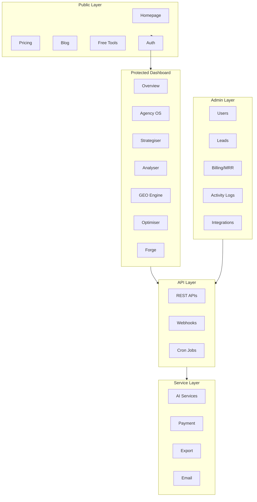

# Aureon One (Media Plan Pro) — Platform Architecture Audit

**Audit Date**: December 20, 2024  
**Platform Version**: 1.0 Production  
**Auditor**: Senior Full-Stack Engineer

---

## Executive Summary

Aureon One is an **enterprise-grade AI Marketing Operating System** comprising 6 major product modules, 150+ pages, 239 API endpoints, and 35+ free marketing tools. The platform represents **2,500-3,500 development hours** at enterprise consulting rates.

| Metric | Value |
|--------|-------|
| Total Pages | 150+ |
| API Endpoints | 239 |
| Component Directories | 30 |
| Service Modules | 29 |
| Free Tools | 35+ |
| Product Modules | 6 |

---

## Platform Architecture Overview

---

## 1. Product Modules & Features

### 1.1 The Strategiser ✅ LIVE
**AI-powered marketing strategy generator**

| Feature | Status | Description |
|---------|--------|-------------|
| Strategy Builder | ✅ Live | Multi-step form with 10+ inputs |
| AI Strategy Generation | ✅ Live | OpenAI GPT-4 + Gemini fallback |
| Strategy Templates | ✅ Live | Industry-specific templates |
| PDF/PPTX/DOCX Export | ✅ Live | White-label capable |
| Strategy History | ✅ Live | Save & manage past strategies |
| AI Insights | ✅ Live | Actionable recommendations |
| KPI Scorecard | ✅ Live | Industry benchmark KPIs |

**Routes**: `/strategiser/*`, `/dashboard/strategies/*`

---

### 1.2 The Analyser ✅ LIVE
**Competition & market intelligence**

| Feature | Status | Description |
|---------|--------|-------------|
| Competition Analysis | ✅ Live | AI-powered competitor research |
| SEO Audit | ✅ Live | Technical & content SEO analysis |
| Content Gap Analysis | ✅ Live | Identify content opportunities |
| Backlink Analysis | ✅ Live | Link profile insights |
| Keyword Research | ✅ Live | Search volume & difficulty |
| Brand Voice Analyzer | ✅ Live | Tone & messaging analysis |
| Analytics Reports | ✅ Live | Exportable insights |

**Routes**: `/analyser/*`, `/dashboard/competition/*`

---

### 1.3 Agency OS ✅ LIVE
**Complete agency management platform**

| Feature | Status | Description |
|---------|--------|-------------|
| Client Workspaces | ✅ Live | Isolated client environments |
| Project Management | ✅ Live | Tasks, Gantt charts, timelines |
| Content Calendar | ✅ Live | Multi-platform scheduling |
| Asset Library | ✅ Live | File management with versioning |
| Time Tracker | ✅ Live | Billable hours tracking |
| Workload View | ✅ Live | Team capacity planning |
| Client Portal | ✅ Live | White-label client access |
| Agency Branding | ✅ Live | Custom logos, colors, fonts |
| Invoicing | ✅ Live | Generate branded invoices |
| Team Management | ✅ Live | 10 seats, role-based access |
| Campaign Manager | ✅ Live | Kanban + calendar views |
| Reports Dashboard | ✅ Live | Client-facing analytics |

**Routes**: `/agency/*`, `/dashboard/agency-os/*`

---

### 1.4 GEO Engine ⏳ COMING SOON
**Generative Engine Optimization for AI search**

| Feature | Status | Description |
|---------|--------|-------------|
| GEO Audit | ⏳ Coming Soon | AI search visibility analysis |
| Entity Optimization | ⏳ Coming Soon | Knowledge graph targeting |
| Featured Snippet Targeting | ⏳ Coming Soon | Zero-click optimization |
| Voice Search Optimization | ⏳ Coming Soon | Conversational query targeting |

**Routes**: `/dashboard/geo/*`

---

### 1.5 The Optimiser ⏳ COMING SOON
**AI-powered campaign optimization**

| Feature | Status | Description |
|---------|--------|-------------|
| Campaign Dashboard | ⏳ Coming Soon | Real-time performance |
| AI Copilot | ⏳ Coming Soon | Recommendation engine |
| Budget Optimizer | ⏳ Coming Soon | ML-based allocation |
| Creative Testing | ⏳ Coming Soon | A/B test automation |
| Multi-platform Sync | ⏳ Coming Soon | Google, Meta, LinkedIn |

**Routes**: `/optimizer/*`, `/dashboard/marketing/*`

---

### 1.6 Aureon Forge 🧪 BETA
**Visual AI workflow builder**

| Feature | Status | Description |
|---------|--------|-------------|
| Flow Builder | 🧪 Beta | Drag-and-drop canvas |
| LLM Nodes | 🧪 Beta | Text generation |
| Image Generation | 🧪 Beta | AI image creation |
| Video Generation | 🧪 Beta | AI video (placeholder) |
| HTTP Nodes | 🧪 Beta | API integrations |
| Spark Credits | 🧪 Beta | Usage-based billing |
| Run History | 🧪 Beta | Execution logs |

**Routes**: `/forge/*`

---

## 2. Free Marketing Tools (35+)

### 2.1 Advertising Tools
| Tool | Path |
|------|------|
| Ad Copy Generator | `/tools/advertising/ad-copy` |
| Google Ads Budget Calculator | `/tools/advertising/budget-calculator` |
| Facebook Ads Manager | `/tools/advertising/facebook-ads` |
| Display Ads Creator | `/tools/advertising/display-ads` |

### 2.2 Calculator Tools
| Tool | Path |
|------|------|
| ROI Calculator | `/tools/calculators/roi` |
| CPM Calculator | `/tools/calculators/cpm` |
| CPA Calculator | `/tools/calculators/cpa` |

### 2.3 Content Tools
| Tool | Path |
|------|------|
| Blog Title Generator | `/tools/content/blog-title-generator` |
| Content Calendar | `/tools/content/calendar` |
| Headline Analyzer | `/tools/content/headline-analyzer` |
| Readability Checker | `/tools/content/readability` |
| Content Optimizer | `/tools/content/optimizer` |
| Landing Page Builder | `/tools/content/landing-page` |
| CTA Generator | `/tools/content/cta-generator` |

### 2.4 Email Tools
| Tool | Path |
|------|------|
| Email Subject Line Tester | `/tools/email/subject-line` |
| Email Template Builder | `/tools/email/template-builder` |
| Cold Email Generator | `/tools/email/cold-email` |

### 2.5 SEO Tools
| Tool | Path |
|------|------|
| Meta Tag Generator | `/tools/seo/meta-generator` |
| Keyword Density Checker | `/tools/seo/keyword-density` |
| Schema Markup Generator | `/tools/seo/schema-markup` |
| Robots.txt Generator | `/tools/seo/robots-txt` |
| Sitemap Generator | `/tools/seo/sitemap` |
| Canonical URL Checker | `/tools/seo/canonical` |

### 2.6 Social Media Tools
| Tool | Path |
|------|------|
| Social Media Calendar | `/tools/social/calendar` |
| Hashtag Generator | `/tools/social/hashtag` |
| Post Scheduler | `/tools/social/scheduler` |
| Bio Generator | `/tools/social/bio-generator` |
| Thread Maker | `/tools/social/thread-maker` |

---

## 3. Admin & Analytics Features

### 3.1 Admin Dashboard (11 Features)

| Feature | Path | Description |
|---------|------|-------------|
| User Management | `/dashboard/admin/users` | CRUD users, roles, permissions |
| Lead Management | `/dashboard/admin/leads` | Lead capture, analytics, export |
| Activity Logs | `/dashboard/admin/activity` | User activity audit trail |
| Admin Analytics | `/dashboard/admin/analytics` | Usage, engagement metrics |
| Billing & MRR | `/admin/billing` | MRR, ARR, subscriptions, payments |
| Integrations | `/dashboard/admin/integrations` | Google Analytics, Mailchimp |
| Strategy Metrics | `/dashboard/admin/strategy-metrics` | AI generation success rates |
| Tracking | `/dashboard/admin/tracking` | Event tracking configuration |
| Governor | `/dashboard/admin/governor` | API rate limiting |
| Settings | `/dashboard/admin/settings` | Feature flags, site config |
| API Config | `/admin/api-config` | External API keys |

### 3.2 Revenue Metrics Dashboard

| Metric | Description |
|--------|-------------|
| MRR | Monthly Recurring Revenue |
| ARR | Annual Run Rate |
| ARPU | Average Revenue Per User |
| Churn Rate | Monthly churn percentage |
| LTV | Customer Lifetime Value |
| CAC | Customer Acquisition Cost |
| Per-Product MRR | Breakdown by module |

---

## 4. API Architecture

### 4.1 API Endpoint Summary (239 Endpoints)

| Category | Endpoints | Key Routes |
|----------|-----------|------------|
| Authentication | 6 | `/api/auth/*` |
| Strategies | 12 | `/api/strategies/*` |
| Agency | 32 | `/api/agency/*` |
| Analyser | 24 | `/api/analyser/*` |
| Blog Engine | 13 | `/api/blog/*` |
| Competition | 5 | `/api/competition/*` |
| Forge | 12 | `/api/forge/*` |
| Growth Suite | 11 | `/api/growth-suite/*` |
| Optimizer | 8 | `/api/optimizer/*` |
| Integrations | 16 | `/api/integrations/*` |
| Payments | 8 | `/api/payments/*`, `/api/stripe/*`, `/api/razorpay/*` |
| Webhooks | 3 | `/api/webhooks/*` |
| Cron Jobs | 3 | `/api/cron/*` |
| Admin | 39 | `/api/admin/*` |
| Tools | 5 | `/api/tools/*` |
| User | 3 | `/api/user/*` |
| Other | 39 | Various utilities |

### 4.2 Key Integrations

| Integration | Status | Purpose |
|-------------|--------|---------|
| Clerk Auth | ✅ Live | Authentication & user management |
| OpenAI GPT-4 | ✅ Live | AI strategy generation |
| Google Gemini | ✅ Live | AI fallback & insights |
| Razorpay | ✅ Live | Indian payment gateway |
| Stripe | ⏳ Config | International payments |
| Google Analytics | ✅ Live | Admin analytics integration |
| Mailchimp | ✅ Live | Email marketing integration |
| Pusher | ✅ Live | Real-time notifications |
| AWS S3 | ✅ Live | File storage |
| IndexNow | ✅ Live | SEO indexing |

---

## 5. Technical Stack

| Layer | Technology |
|-------|------------|
| Framework | Next.js 16 (App Router) |
| Language | TypeScript |
| Styling | Tailwind CSS + Custom Design System |
| Database | PostgreSQL (Prisma ORM) |
| Auth | Clerk |
| State | React Context + SWR |
| UI Components | Radix UI + Custom |
| Animations | Framer Motion |
| AI | OpenAI + Google Gemini |
| Payments | Razorpay + Stripe |
| Storage | AWS S3 |
| Hosting | Vercel |

---

## 6. Development Hours Estimate

### Enterprise Consulting Rates (TCS/Accenture/IBM India)

| Role | Hourly Rate (USD) |
|------|-------------------|
| Senior Developer | $45-65 |
| Tech Lead | $75-100 |
| Solution Architect | $100-150 |
| UI/UX Designer | $40-60 |
| QA Engineer | $30-45 |
| Project Manager | $50-80 |

### Development Breakdown

| Module | Complexity | Est. Hours | Cost (at $60/hr avg) |
|--------|------------|------------|----------------------|
| **Core Infrastructure** | High | 400 | $24,000 |
| Next.js setup, auth, DB schema | | | |
| API architecture, error handling | | | |
| CI/CD, deployment pipelines | | | |
| | | | |
| **The Strategiser** | High | 450 | $27,000 |
| Multi-step form builder | | | |
| AI integration (OpenAI + Gemini) | | | |
| Strategy processor (35K lines) | | | |
| Export engine (PDF/PPTX/DOCX) | | | |
| Template system | | | |
| | | | |
| **The Analyser** | High | 350 | $21,000 |
| Competition analysis engine | | | |
| SEO audit system | | | |
| AI-powered insights | | | |
| Report generation | | | |
| | | | |
| **Agency OS** | Very High | 600 | $36,000 |
| Client workspaces | | | |
| Project management (Gantt, tasks) | | | |
| Content calendar | | | |
| Asset library with versioning | | | |
| Time tracking | | | |
| Client portal | | | |
| Invoicing system | | | |
| Team management | | | |
| | | | |
| **GEO Engine** | Medium | 200 | $12,000 |
| UI & gating (COMING SOON) | | | |
| Initial framework | | | |
| | | | |
| **The Optimiser** | Medium | 200 | $12,000 |
| UI & gating (COMING SOON) | | | |
| Campaign dashboard | | | |
| | | | |
| **Aureon Forge** | High | 350 | $21,000 |
| Visual flow builder | | | |
| Node system (LLM, Image, Video) | | | |
| Execution engine | | | |
| Spark credit system | | | |
| | | | |
| **Free Tools (35+)** | Medium | 300 | $18,000 |
| Individual tool pages | | | |
| Calculator logic | | | |
| Generator algorithms | | | |
| | | | |
| **Admin Dashboard** | High | 250 | $15,000 |
| User management | | | |
| Lead management | | | |
| MRR/ARR analytics | | | |
| Activity logging | | | |
| Feature flags | | | |
| | | | |
| **Payment System** | High | 150 | $9,000 |
| Razorpay integration | | | |
| Subscription management | | | |
| Credit system | | | |
| Invoice generation | | | |
| | | | |
| **UI/UX Design** | High | 200 | $12,000 |
| Design system | | | |
| 150+ page designs | | | |
| Responsive layouts | | | |
| Animations | | | |
| | | | |
| **QA & Testing** | Medium | 150 | $9,000 |
| Unit tests | | | |
| Integration tests | | | |
| E2E testing | | | |
| | | | |
| **Documentation** | Low | 50 | $3,000 |
| API docs | | | |
| User guides | | | |

### Total Development Estimate

| Metric | Value |
|--------|-------|
| **Total Hours** | **3,650** |
| **Cost at $60/hr** | **$219,000** |
| **Cost at $80/hr (US rates)** | **$292,000** |
| **Cost at $120/hr (Big 4 rates)** | **$438,000** |

> [!IMPORTANT]
> At TCS/Accenture/IBM enterprise rates with project management overhead (1.3x multiplier), this project would cost **$285,000 - $570,000**.

---

## 7. Revenue Potential Analysis

### 7.1 Pricing Tiers

| Plan | Price (INR) | Price (USD) | Target |
|------|-------------|-------------|--------|
| Free | ₹0 | $0 | Lead magnet |
| Pro | ₹4,099/mo | $49/mo | Freelancers |
| Agency | ₹24,999/mo | $299/mo | Agencies |
| Enterprise | Custom | Custom | Large corps |

### 7.2 Revenue Scenarios

#### Conservative (Year 1)
| Plan | Users | MRR | ARR |
|------|-------|-----|-----|
| Free | 5,000 | $0 | $0 |
| Pro | 200 | $9,800 | $117,600 |
| Agency | 50 | $14,950 | $179,400 |
| Enterprise | 5 | $7,500 | $90,000 |
| **Total** | **5,255** | **$32,250** | **$387,000** |

#### Moderate (Year 1)
| Plan | Users | MRR | ARR |
|------|-------|-----|-----|
| Free | 15,000 | $0 | $0 |
| Pro | 500 | $24,500 | $294,000 |
| Agency | 150 | $44,850 | $538,200 |
| Enterprise | 15 | $22,500 | $270,000 |
| **Total** | **15,665** | **$91,850** | **$1,102,200** |

#### Aggressive (Year 1)
| Plan | Users | MRR | ARR |
|------|-------|-----|-----|
| Free | 50,000 | $0 | $0 |
| Pro | 2,000 | $98,000 | $1,176,000 |
| Agency | 500 | $149,500 | $1,794,000 |
| Enterprise | 50 | $75,000 | $900,000 |
| **Total** | **52,550** | **$322,500** | **$3,870,000** |

### 7.3 Lifetime Value (LTV) by Plan

| Plan | Avg Lifespan | LTV |
|------|--------------|-----|
| Pro | 8 months | $392 |
| Agency | 18 months | $5,382 |
| Enterprise | 36 months | $54,000 |

### 7.4 Revenue Levers

1. **Free → Pro Conversion**: Target 4% conversion rate
2. **Pro → Agency Upsell**: Target 15% annual upgrade
3. **Agency LTV**: Focus on retention via white-label stickiness
4. **Enterprise Pipeline**: Direct sales to large agencies
5. **Usage-Based (Forge)**: Spark credits at scale

---

## 8. Competitive Advantage

| Advantage | Description |
|-----------|-------------|
| **All-in-One** | Strategy + Execution + Analytics in one platform |
| **AI-Native** | GPT-4 + Gemini for intelligent recommendations |
| **Agency-First** | White-label, multi-seat, client portals |
| **India Pricing** | Localized INR pricing with Razorpay |
| **70+ Free Tools** | SEO, advertising, email, social tools |
| **Modern Stack** | Next.js 16, TypeScript, Prisma, Vercel |

---

## 9. Production Readiness Checklist

| Item | Status |
|------|--------|
| Build passes | ✅ 361 pages |
| All routes respond | ✅ HTTP 200 |
| Auth working | ✅ Clerk integrated |
| Payments configured | ✅ Razorpay ready |
| Database schema | ✅ PostgreSQL + Prisma |
| AI integrations | ✅ OpenAI + Gemini |
| Admin dashboard | ✅ 11 features |
| Feature flags | ✅ Database-driven |
| Coming Soon gating | ✅ GEO + Optimiser |
| Error boundaries | ✅ Global + per-route |

---

## 10. Recommendations

### Immediate Actions
1. Complete Razorpay production keys configuration
2. Set up Stripe for international payments
3. Launch marketing campaign for free tools
4. Begin Pro + Agency sales outreach

### 30-Day Roadmap
1. Complete GEO Engine integration
2. Add more industry-specific strategy templates
3. Implement referral program
4. Set up automated onboarding emails

### 90-Day Roadmap
1. Launch The Optimiser with ad platform integrations
2. Expand Forge node library
3. Add custom domain support for Agency tier
4. Build partnership program

---

**Document Version**: 1.0  
**Last Updated**: December 20, 2024  
**Author**: Platform Architecture Team
